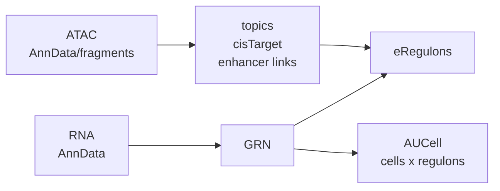

# rustscenic

[](https://github.com/Ekin-Kahraman/rustscenic/actions/workflows/audit.yml)
[](LICENSE)
[](https://www.python.org/)
[](https://www.rust-lang.org/)

A Rust + PyO3 replacement for the SCENIC / SCENIC+ compute stack: one install, modern Python, low-memory CPU execution, and atlas-scale regulatory-network analysis without Java, dask, CUDA, or fragile multi-tool environments.

```bash
pip install rustscenic
```

Five runtime dependencies (numpy, pandas, pyarrow, scipy, anndata). Python 3.10–3.13, Linux + macOS (x86_64 + aarch64). No dask, no Java, no CUDA.

The practical SCENIC+ compute path in one package:



## Status

**Current release: v0.4.1** on PyPI. v0.4.0 established publishable real-data end-to-end on PBMC and mouse brain E18 multiome via the public `pipeline.run`; v0.4.1 fixes `pipeline.run(tfs="hs"/"mm")` species shortcuts. See [CHANGELOG](CHANGELOG.md) and [`validation/`](validation/) for evidence and caveats.

Open follow-ups tracked for v0.4.x: AUCell wall-time logs from the 2026-04 stack pending a refresh, region-cistarget kernel parity vs ctxcore, and raw 10x `pipeline.run` without caller-side ATAC pre-subset (current docs require the subset).

## Goal

rustscenic is being built as the single-install replacement for the practical SCENIC / SCENIC+ workflow: RNA GRN inference, AUCell regulon activity, motif enrichment, ATAC fragment preprocessing, topic modelling, enhancer-gene linking, and eRegulon assembly in one package.

The project is intentionally not a thin wrapper around the old stack. The target is a simpler architecture that makes regulatory-network analysis easier to install, cheaper to run on CPU, deterministic under a fixed seed, and robust to real atlas conventions such as ENSEMBL `var_names`, duplicate gene symbols, backed AnnData, and UCSC/Ensembl chromosome mismatches.

## What it does

Rust-native replacements for the compute stages plus the glue that scenicplus builds eRegulons from:

| Stage | **rustscenic** | Replaces |
|---|---|---|
| Gene-regulatory network inference | `rustscenic.grn.infer` | `arboreto.grnboost2` |
| Per-cell regulon activity scoring | `rustscenic.aucell.score` | `pyscenic.aucell.aucell` |
| Topic modelling on scATAC peaks (Online VB) | `rustscenic.topics.fit` | `pycisTopic` (gensim VB) |
| Topic modelling K ≥ 30 (Mallet-class collapsed Gibbs) | `rustscenic.topics.fit_gibbs` | `pycisTopic` (Mallet, Java) |
| Motif-regulon enrichment | `rustscenic.cistarget.enrich` | `pycistarget` AUC kernel |
| ATAC fragments → cells × peaks matrix | `rustscenic.preproc.fragments_to_matrix` | `pycisTopic` fragment loader |
| Cell QC (TSS enrichment, FRiP, insert size) | `rustscenic.preproc.qc` | `pycisTopic.qc` |
| Enhancer → gene correlation | `rustscenic.enhancer.link_peaks_to_genes` | `scenicplus` p2g linking |
| eRegulon assembly (TF × enhancers × target genes) | `rustscenic.eregulon.build_eregulons` | `scenicplus` eRegulon builder |
| End-to-end pipeline orchestrator | `rustscenic.pipeline.run` | `scenicplus` snakemake |

Bundled with the wheel: HGNC (1,839 human) and MGI (1,721 mouse) TF lists via `rustscenic.data.tfs(species)`. Motif rankings can be fetched and cached via `rustscenic.data.download_motif_rankings`. Cellxgene-curated h5ads (ENSEMBL IDs in `var_names`, gene symbols in `var["feature_name"]`) are auto-detected so atlas data works without manual patching.

## Quick example (PBMC-3k, RNA GRN + AUCell)

```python
import anndata as ad
import rustscenic.grn, rustscenic.aucell

import rustscenic.data

adata = ad.read_h5ad("rna.h5ad")
tfs = rustscenic.data.tfs("hs")  # bundled HGNC list (1,839 TFs)

# 1. GRN inference
grn = rustscenic.grn.infer(adata, tf_names=tfs, n_estimators=5000, seed=777)

# 2. Build top-50-target regulons and score per-cell activity
regulons = [
    (f"{tf}_regulon", grn[grn["TF"] == tf].nlargest(50, "importance")["target"].tolist())
    for tf in grn["TF"].unique()
]
auc = rustscenic.aucell.score(adata, regulons, top_frac=0.05)
```

Full RNA example script: [`examples/pbmc3k_end_to_end.py`](examples/pbmc3k_end_to_end.py). Runs in about 3 minutes on an 8-core laptop with `n_estimators=500`. [`docs/tester-quickstart.md`](docs/tester-quickstart.md) is the collaborator smoke-test path.

## Measured against the pyscenic / arboreto reference

Same input on both sides. Every row has a log file under [`validation/`](validation/).

| Axis | pyscenic / arboreto | **rustscenic** |
|---|---|---|
| Installs on fresh Python 3.10–3.13 venv | arboreto: `TypeError: Must supply at least one delayed object` (dask_expr); pyscenic: `ModuleNotFoundError: pkg_resources` in current stacks | PyPI wheels and sdist install; core APIs import |
| AUCell wall-time, Ziegler 2021 atlas (31,602 × 59; measured 2026-04, refresh tracked for v0.4.x) | 6.81 s (pyscenic) | 0.25 s |
| AUCell wall-time, 10x Multiome (10,290 × 1,457; measured 2026-04, refresh tracked for v0.4.x) | 18.6 s (pyscenic) | 0.21 s |
| Peak RSS, 4 stages on 100,000 cells × 20,292 genes | > 40 GB (reported) | 6.3 GB |
| Cistarget kernel vs `ctxcore.recovery.aucs` | reference | Pearson 1.0000, mean abs diff 2.4 × 10⁻⁵ |
| AUCell per-cell Pearson vs pyscenic (Ziegler, 31,602 cells; measured 2026-04, refresh tracked for v0.4.x) | reference | 0.984 mean, 91.7 % of cells > 0.95 |
| Canonical airway TFs matching literature (Ziegler, n=14) | 8 / 14 (pyscenic, unit weights) | 8 / 14 — same hits, same 5/14 misses |
| Bit-identical output under same seed across threaded runs | no (dask non-determinism) | yes |
| Runtime dependencies | 40 + | 5 |

Tool-to-tool variation (same hits, same misses on the same 14 canonical TFs) is smaller than the dataset-inherent noise, consistent with rustscenic being numerically equivalent to pyscenic at the per-cell level.

## Per-stage detail

Numbers are **rustscenic**'s values. The measurement context (dataset, `n_cells`, version) is in each row. v0.4.x parity refresh against current upstream stacks is tracked in [`docs/v0.4.x-benchmark-plan.md`](docs/v0.4.x-benchmark-plan.md).

### GRN — `arboreto.grnboost2` replacement

| Measurement | Value |
|---|---|
| Per-edge Spearman vs arboreto (PBMC-3k scanpy, n_estimators=5000, 480,680 shared edges, v0.3.10) | 0.611 |
| Within-TF Spearman, mean across 1,274 TFs (same fixture) | 0.632 (median 0.649) |
| Per-edge Spearman vs arboreto (multiome3k, n_estimators=5000, 816 k common edges, 2026-04) | 0.58 |
| Per-target TF-ranking Spearman mean | 0.57 |
| TRRUST known TF→target edges recovered (PBMC-3k) | 17 / 18 (94 %) |
| Lineage TFs correctly enriched in expected cell types (PBMC-10k) | 8 / 8 (SPI1, PAX5, EBF1, TCF7, LEF1, TBX21, CEBPD, IRF8) |
| Cortex marker TFs present in regulon set (E18 multiome, 4,770 cells, v0.3.10; name-presence, not cell-type enrichment) | 9 / 9 (Pax6, Neurod2, Sox2, Ascl1, Tbr1, Neurog2, Fezf2, Eomes, Foxg1) |
| MITF regulon activity, Tirosh 2016 melanoma — malignant vs TME | 3.48× |
| Wall vs pyscenic on PBMC-3k (n_estimators=5000, seed 777, Apple M5, v0.3.10; pyscenic in sync mode — not apples-to-apples against dask-parallel) | 214 s vs 381 s (1.78×) |
| 100k-cell bootstrap, n_estimators=100 | 17 min / 5.0 GB peak RSS |

Edge rankings disagree with arboreto at fine grain (per-edge Spearman 0.611 on PBMC-3k v0.3.10 / 0.58 on multiome3k 2026-04, top-10k Jaccard 0.20) — expected consequence of independent histogram-GBM quantisation. Coarse biology converges (per-TF Spearman ≈ 0.65, all canonical lineage TFs recovered on both human PBMC and mouse cortex). Downstream AUCell is 0.99 per-cell with pyscenic, so edge-ranking differences do not propagate.

### AUCell — `pyscenic.aucell` replacement

| Measurement | Value |
|---|---|
| Per-cell Pearson vs pyscenic (10x Multiome, 2,588 × 1,457) | 0.988 mean, 99.5 % of cells > 0.95 |
| Per-cell Pearson vs pyscenic (Ziegler atlas, 31,602 × 59) | 0.984 mean, 91.7 % of cells > 0.95 |
| Per-regulon Pearson (10x Multiome) | 0.87 mean, 90.5 % > 0.80 |
| Exact top-regulon-per-cell match (Multiome) | 88.4 % |
| Wall-time, 10k cells × 1,457 regulons | 0.21 s (vs 18.6 s pyscenic) |
| 100 k cells × 500 regulons | 10 s, 5.6 GB peak RSS |

### Topics — `pycisTopic` LDA replacement (Online VB + collapsed Gibbs)

Two algorithms ship side-by-side:
- `rustscenic.topics.fit` — Online VB LDA, fastest at K ≤ 10.
- `rustscenic.topics.fit_gibbs` — collapsed Gibbs (Mallet's algorithm class). Add `n_threads=N` for parallel AD-LDA.

Real PBMC 3k Multiome ATAC, 1,500 cells × 98,319 peaks, K = 30, intrinsic top-10 NPMI on the training corpus:

| Tool | Wall | Unique topics (of 30) | Top-10 NPMI mean |
|---|---|---|---|
| `rustscenic.topics.fit` (Online VB) | 104 s | 2 / 30 (collapsed) | +0.012 |
| `rustscenic.topics.fit_gibbs` (serial) | 191 s | **22 / 30** | **+0.031** |
| `rustscenic.topics.fit_gibbs` (8-thread) | **84 s** | 25 / 30 | +0.019 |
| Mallet (pycisTopic reference) | n/a | 24 / 30 | 0.196 (extrinsic) |

Collapsed Gibbs gives ~11× more distinct topics than Online VB on sparse scATAC at K = 30 and ~2.7× higher intrinsic NPMI; the parallel AD-LDA path adds a 2.56× wall-clock speedup at 8 threads while preserving topic diversity. Mallet's published 0.196 is an extrinsic NPMI (different protocol, not directly comparable in absolute scale). See [`docs/topic-collapse.md`](docs/topic-collapse.md) and [`docs/bench-vs-references.md`](docs/bench-vs-references.md). Reproduce with `python validation/scaling/bench_npmi_head_to_head.py` and `python validation/scaling/bench_gibbs_parallel.py`.

### Cistarget — `pycistarget` AUC kernel replacement

Validated on the aertslab hg38 v10 feather database (5,876 motifs × 27,015 genes):

| Measurement | Value |
|---|---|
| Per-regulon Pearson vs `ctxcore.recovery.aucs` (58 TRRUST regulons) | 1.0000 (all > 0.9999, abs diff 2.4 × 10⁻⁵) |
| Self-consistency (motif's own top-500 genes → rank #1) | 10 / 10 |
| TRRUST at scale (166 TFs ≥ 10 targets): TF-annotated motif ranks #1 | 19 % |
| Same benchmark: any TF-motif in top-100 | 68 – 100 % (rises with regulon size) |
| Mouse mm10 cross-species (5 TRRUST TFs) | 2 / 5 rank #1, 4 / 5 in top-5 |
| 100 k-cell workload × 100 regulons | 2.6 s, 6.3 GB peak RSS |

Bit-identical to `ctxcore.recovery.aucs` at float32 precision. The 19 % rank-#1 rate is the scaled-out TRRUST-vs-motif-binding benchmark, a property of the gold-standard mismatch, not the implementation.

### End-to-end + determinism

| Pipeline | Wall | Peak RSS | Stages |
|---|---|---|---|
| Reference (arboreto + pyscenic + tomotopy), 10x Multiome 3k | 11.8 min | n/a | 4 |
| rustscenic, 10x Multiome 3k | 9.1 min | n/a | 4 |
| rustscenic, **100k synthetic multiome E2E** | **12.7 min** | **7.09 GB** | **7 (all)** |
| rustscenic, **200k synthetic multiome E2E** | **16.8 min** | **7.44 GB** | **7 (all)** |

Memory: 100k synthetic multiome 7-stage E2E peaks at **7.09 GB RSS**, vs scenicplus stack's reported > 40 GB at comparable scale. Bit-identical output under the same seed across threaded runs, verified across three consecutive runs per stage. 10 / 10 robustness edge-case tests pass (foreign genes, NaN input, duplicate gene names, all-zero cells, large regulons, object-dtype rankings, n_topics = 0, very-sparse matrices). Reproduce with `python validation/scaling/bench_e2e_100k_synthetic.py`; reproduce the 200k synthetic run with `python validation/scaling/bench_e2e_200k_synthetic.py`.

## Scope and alternatives

rustscenic covers the practical SCENIC / SCENIC+ compute path on CPU. Adjacent tools with different scope:

- **GPU, CUDA** — [flashSCENIC](https://github.com/haozhu233/flashscenic) (uses RegDiffusion, a different algorithm from GENIE3 / GRNBoost2, so outputs are not pyscenic-numerical).
- **Multiomic enhancer-aware GRN** — [scenicplus](https://github.com/aertslab/scenicplus) (joint scRNA + scATAC enhancer inference; superset of this scope).
- **TF-activity scoring from prebuilt regulons, no GRN inference** — [decoupler-py](https://saezlab.github.io/decoupler-py/) with CollecTRI.
- **R Bioconductor ecosystem** — the original R-SCENIC or [Epiregulon](https://www.nature.com/articles/s41467-025-62252-5).

rustscenic does not bundle the aertslab motif ranking feather databases (300 MB – 35 GB). Users fetch them from [`resources.aertslab.org`](https://resources.aertslab.org/) and pass the resulting DataFrame to `cistarget.enrich`.

## CLI

```bash
# End-to-end orchestrator (recommended):
rustscenic pipeline  --rna data.h5ad --tfs tfs.txt --output out/

# Per-stage CLI:
rustscenic grn       --expression data.h5ad --tfs tfs.txt --output grn.parquet
rustscenic aucell    --expression data.h5ad --regulons grn.parquet --output auc.parquet
rustscenic topics    --expression atac.h5ad --output topics --n-topics 30
rustscenic cistarget --rankings motifs.feather --regulons grn.parquet --output enrichment.tsv
```

## Repo layout

- `crates/` — Rust workspace: `rustscenic-{grn, aucell, topics, preproc, py}`
- `python/rustscenic/` — Python package, CLI entry point, type stubs
- `examples/pbmc3k_end_to_end.py` — RNA GRN + AUCell script on real PBMC-3k
- `validation/` — reproducible benchmark scripts + measurement reports for every number above, plus `VALIDATION_SUMMARY.md`
- `tests/` — pytest suite (169 Python tests, 1 skipped) + Rust crate tests (57)
- `manuscript/` — preprint source
- `docs/topic-collapse.md` — known algorithmic caveat

## License

MIT. Algorithm implementations follow the aertslab Python references — original method credit to Aibar et al. 2017 (SCENIC), Bravo González-Blas et al. 2023 (SCENIC+), Hoffman-Blei-Bach 2010 (Online VB LDA).

## Citation and attribution

If you use rustscenic in a paper, report, benchmark, derivative package, or lab workflow, cite the exact release used. GitHub citation metadata is in [`CITATION.cff`](CITATION.cff).

rustscenic was created and is maintained by Ekin Kahraman. See [`AUTHORS.md`](AUTHORS.md) and [`docs/collaboration-and-authorship.md`](docs/collaboration-and-authorship.md) for contribution and authorship expectations.

## Contact

File issues at [github.com/Ekin-Kahraman/rustscenic/issues](https://github.com/Ekin-Kahraman/rustscenic/issues). Bug, correctness, and validation-report templates pre-fill the fields we need. If you ran the pipeline on real data and want the result folded into the v0.4.x sweep, see [`docs/tester-reporting.md`](docs/tester-reporting.md). If reporting ARI or related clustering metrics, include the comparator; see [`docs/evaluation-metrics.md`](docs/evaluation-metrics.md). Coordinated vulnerability disclosure: see [SECURITY.md](SECURITY.md).
